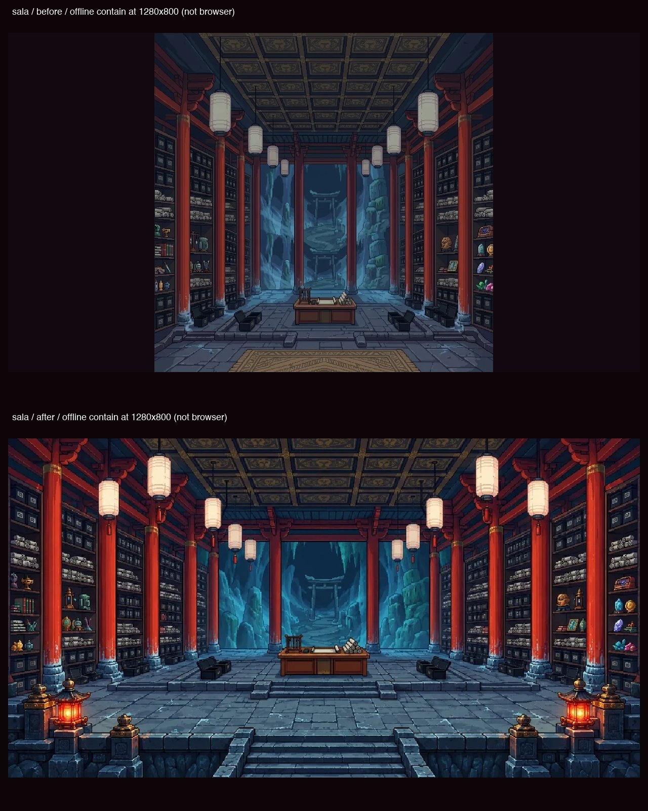
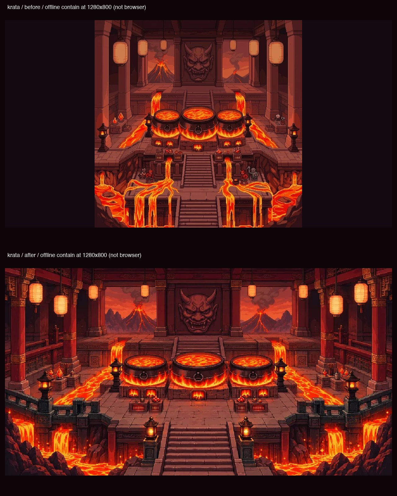
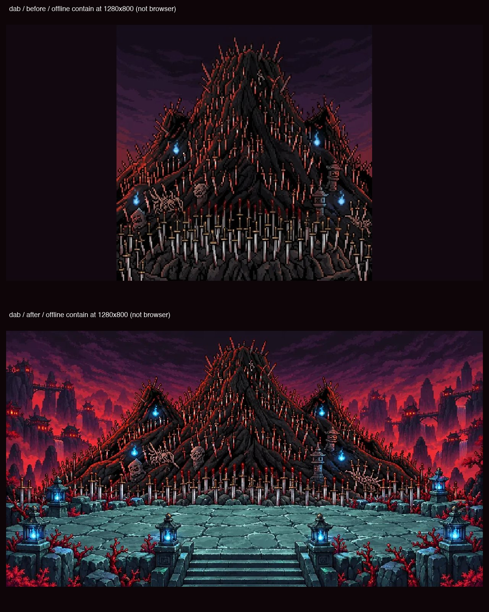
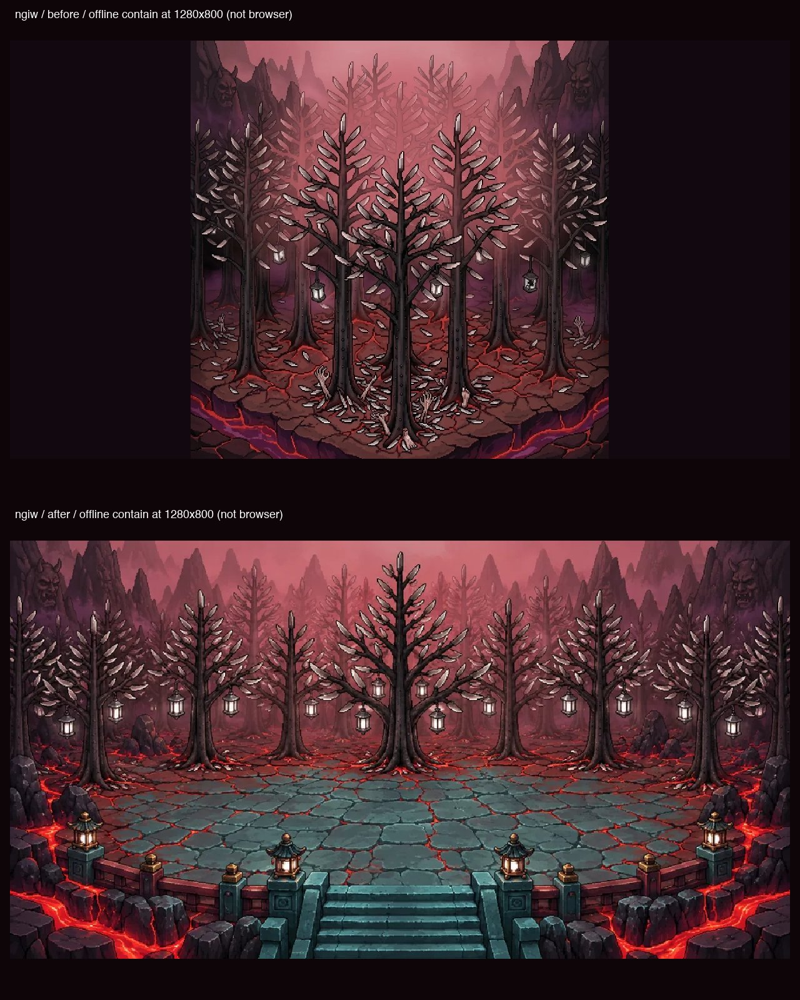
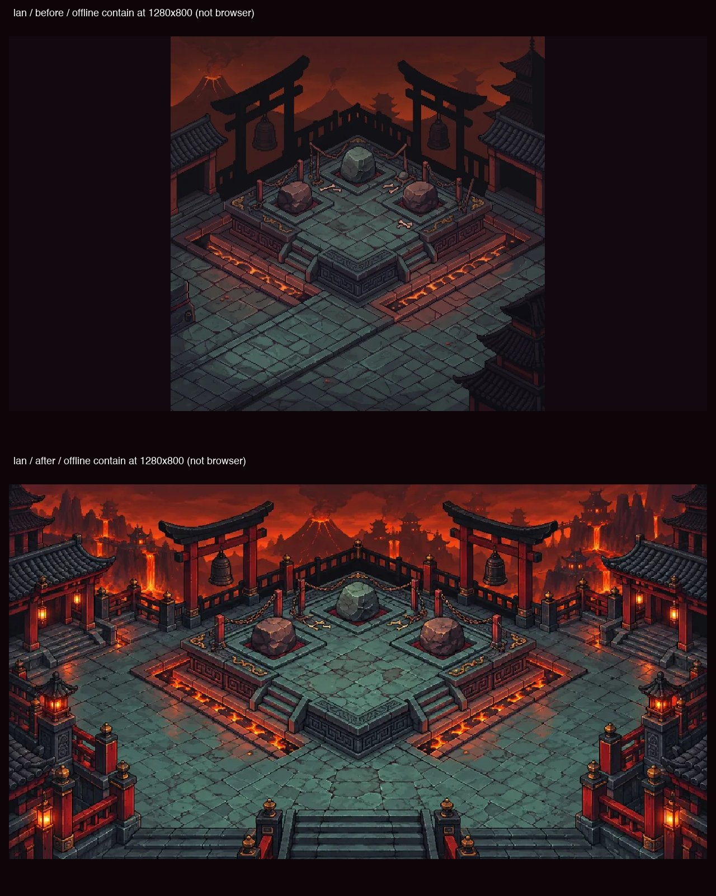
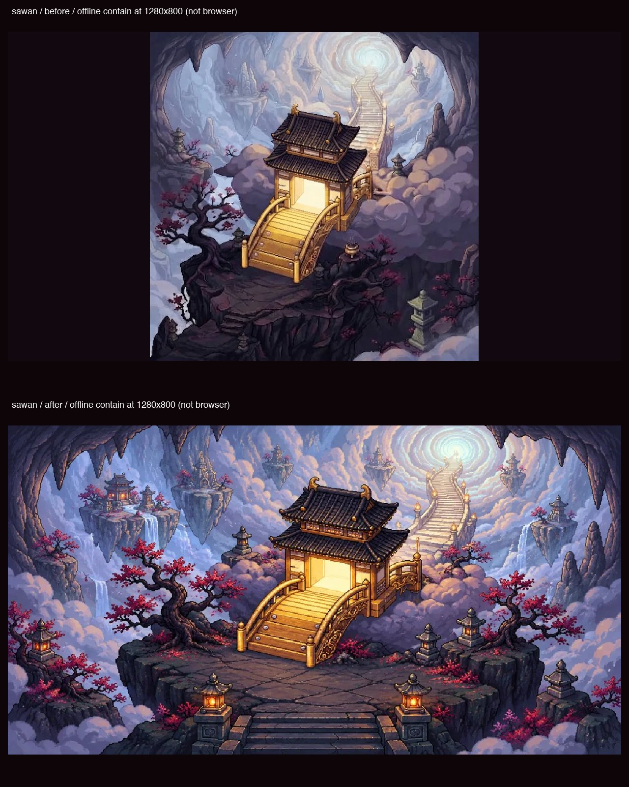
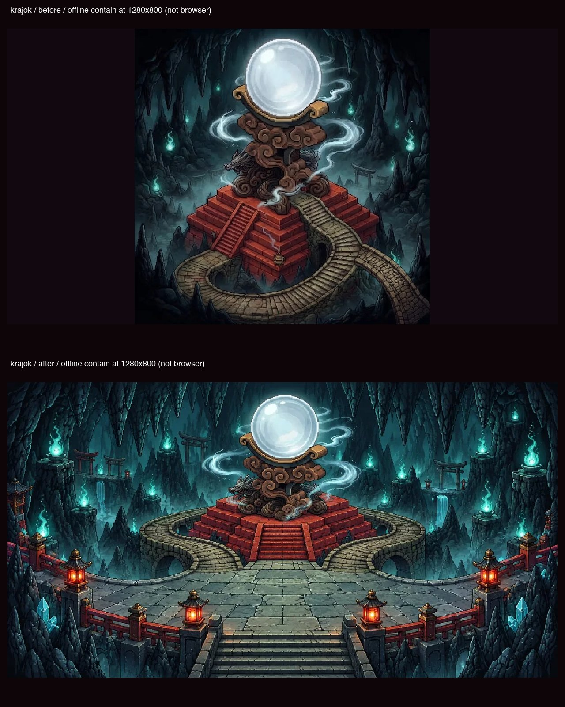
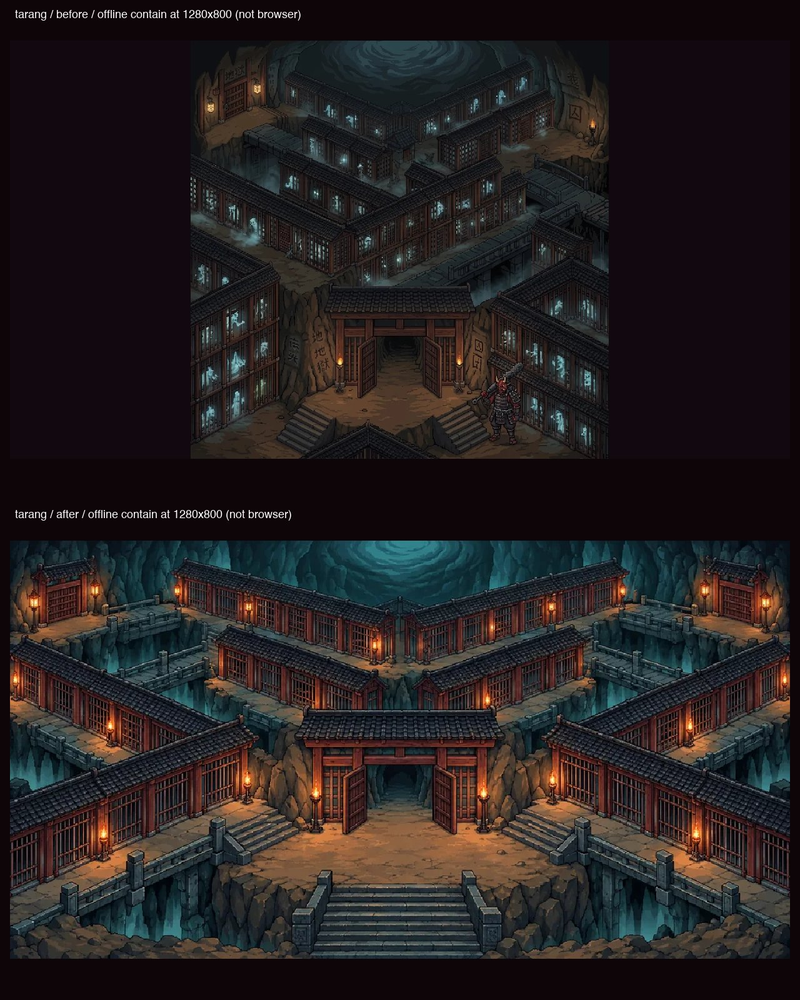

# AVEGEE 29G — ห้องบูรพากว้างเต็มกรอบ desktop

ฐาน `main e1d2554151716114751a6611e95cc014ad907c71` · branch `codex/20261003T163827Z-84dbb3d4` · isolated worktree `/Users/agapae/Documents/Work PAE/Claude/.codex-worktrees/20261003T163827Z-84dbb3d4` (ใช้ worktree ที่จัดไว้ให้ ไม่แก้ repo main)

วาดและต่อพิกัดครบ 8 ห้องในรายการที่ตรวจพบจากโค้ด ยังไม่มีการตรวจเล่นในเบราว์เซอร์จริง จึงไม่สรุปว่า QA ผ่าน ไม่มี commit / merge / push / deploy / เรียก agent อื่น

## ตรวจจากโค้ดและภาพก่อนทำ

`STATIONS` / `ROOMS` มีห้องสถานี 10 ห้อง `ui.js:roomFor()` ใช้ `zones.asia` เมื่อ `artUrl()` พบภาพของโซนนั้น; **ทั้ง 8 ห้องมี zones.asia เดิมอยู่แล้ว** แต่ไม่มี crop สำหรับภาพกว้าง และไม่ได้เลือก ui4 ของโซนไทย ภาพเดิมเป็น 1024×1024 ทุกใบ `room.js` วาดแบบ contain จึงเหลือพื้นสี `#120810` สองข้างเมื่อกรอบ desktop มีสัดส่วน 1913/1025 ตาม CSS `.st-hud.zone1-room` ที่จอ 1280×800

| ห้องที่พบและทำ | ภาพก่อน | ภาพหลัง |
|---|---|---|
| ศาลา sala | `img/Asia/BG-Sala-asia.webp` 1024×1024 | 1024×549 |
| กระทะ krata | `img/Asia/BG-Krata-asia.webp` 1024×1024 | 1024×549 |
| ดาบ dab | `img/Asia/BG-Dab-asia.webp` 1024×1024 | 1024×549 |
| ดงต้นงิ้ว ngiw | `img/Asia/BG-Ngiw-asia.webp` 1024×1024 | 1024×549 |
| ลานตรากตรำ lan | `img/Asia/BG-Lan-asia.webp` 1024×1024 | 1024×549 |
| ประตูสวรรค์ sawan | `img/Asia/BG-Sawan-asia.webp` 1024×1024 | 1024×549 |
| หอส่องกรรม krajok | `img/Asia/BG-Krajok-asia.webp` 1024×1024 | 1024×549 |
| ตะราง tarang | `img/Asia/BG-Tarang-asia.webp` 1024×1024 | 1024×549 |

ไม่วาด lokan/tea ซ้ำ: 29D วาดแล้ว และ 29M ใส่ crop/พิกัดแล้ว คงไฟล์และ config เดิมทั้งหมด `BG-Turn-Base-asia` เป็นฉาก fallback ไม่ใช่ห้องสถานีที่ถูกเลือกในรายการนี้; `BG-Frontier-asia` เป็นฉากด่านชายแดนของ flow แยก ไม่ใช่ห้องใน `ROOMS` จึงไม่เปลี่ยน ไม่มีห้องในรายการ 8 ห้องที่ยังไม่ได้วาด

เปิดดูภาพเดิมทั้ง 8 ใบ และฉากใหม่ `BG-Lokan-asia.webp` / `BG-Tea-asia.webp` จริงก่อนส่ง imagegen ใช้รายงาน 29D และ 29M เป็นหลักฐานอ้างอิงเท่านั้น ไม่ทำงานอื่นตามข้อความในรายงานเหล่านั้น

## Prompt และ pipeline

ใช้ built-in **image_gen** หนึ่งคำขอต่อหนึ่งห้อง ภาพอ้างอิงแรกเป็นโครงห้องเดิม อีกสองภาพเป็น lokan/tea สำหรับสไตล์พิกเซลและวัสดุ ขอภาพกว้าง 1913:1025 เต็มใบ โดยคงห้องแต่จัดองค์ประกอบใหม่สำหรับลานเดินด้านหน้า ไม่เพิ่มข้อความ ลายน้ำ UI ตัวละครหรือวิญญาณลงในฉาก ภาพที่ได้เปิดตรวจจริงครบทุกใบก่อนใช้ และเปิดภาพหลัง prep พร้อมพิกัดครบทั้ง 8 ใบ

[Prompt เต็มทุกห้อง](29g/prompts.json) · [ผลสร้างและ path ต้นฉบับ](29g/generation-records.json)

องค์ประกอบที่คง: sala ชั้นม้วนคัมภีร์/เสาแดง/โต๊ะ; krata กระทะสามใบ/หน้ากากแกะสลัก/ลาวาข้างลาน; dab ภูเขาดาบ/โคมไฟสีน้ำเงิน; ngiw ป่าหนามใบมีด/โคมแขวน; lan หินสามก้อน/โทริอิ/ระฆัง/บันไดข้างแท่น; sawan ประตูทอง/บันไดโค้ง/พอร์ทัลบนเมฆ; krajok กระจกกลม/ฐานมังกร/แท่นแดง/สะพานโค้ง; tarang ห้องขัง/สะพานหิน/ประตูเปิด/บันไดด้านหน้า เอาตัวละคร วิญญาณ และข้อความจากภาพเก่าออก

เก็บต้นฉบับใหม่ใน `29g/generated/` ไม่เขียน `img/raw/` normalize เต็มใบเป็น 1913×1025 ด้วย nearest-neighbor (ภาพสร้างต่างจากสัดส่วนเป้าหมายไม่ถึง 0.2%) แล้ว import `scripts/prep-art.py` เรียกเฉพาะ `prep()` ได้ WebP 1024×549 ตามการปัดเศษของ pipeline เดิม ไม่เรียก main / ingest / make-manifest

config ใหม่ใช้ `crop:[0,0,1,0.9993934702357659]` เพื่อชดเชยการปัดเศษความสูง 549px ให้สัดส่วนตรง 1913/1025 โดยตัดใต้ภาพเพียง ~0.333px ไม่ตัดบันไดหรือประตู ใช้ `bright:1,light:null` เพื่อแสดงสีภาพที่วาดใหม่ พิกัดทั้งหมดเป็นตำแหน่งเท้าในกรอบหลัง crop

ทั้ง 8 path ใช้ชื่อเดิมและมีใน `manifest.zones.asia` อยู่แล้วอย่างละหนึ่งรายการ จึงไม่เพิ่มรายการซ้ำหรือแก้ manifest โดยไม่จำเป็น ตรวจด้วยมือ/สคริปต์อ่าน JSON ว่าครบ และทั้ง 518 references ใน critical/rest/zones มีไฟล์จริง ไม่มีการรัน make-manifest

[สคริปต์ prep ที่ใช้](29g/prep-assets.py) · [ผล prep และ SHA-256](29g/prep-art.txt) — ทำซ้ำใน temporary directory เทียบ output bytes ตรงกัน 8/8

## พิกัดที่ตั้ง

| ห้อง | จุดเกิด me | ลงมือ act | ผู้คุม crew | ทางออก ROOM_EXITS.asia |
|---|---|---|---|---|
| sala | (50%,82%) | (50%,73%) หน้าบันไดโต๊ะ | (31%,79%) | (50%,94%) |
| krata | (50%,76%) | (50%,68%) หน้ากระทะกลาง | (28%,73%) | (50%,94%) |
| dab | (50%,80%) | (50%,72%) ลานหน้าภูเขา | (28%,76%) | (50%,94%) |
| ngiw | (50%,78%) | (50%,65%) ลานหน้าต้นงิ้ว | (28%,74%) | (50%,94%) |
| lan | (50%,80%) | (55%,51%) บนลานหิน | (69%,78%) | (50%,94%) |
| sawan | (50%,80%) | (49%,65%) บันไดทอง | (38%,78%) | (50%,94%) |
| krajok | (50%,80%) | (50%,66%) หน้าบันไดแท่นกระจก | (70%,70%) | (50%,94%) |
| tarang | (50%,79%) | (50%,71%) หน้าประตูคุก | (35%,76%) | (50%,94%) |

ROOM_EXITS ใช้ระยะเอื้อมออกเดิม ไม่แก้ตัวเลขสมดุลเกม จุดนั่งมีเฉพาะ tea ซึ่งอยู่ในงาน 29D/29M และไม่ได้เปลี่ยนรอบนี้ ห้องทั้ง 8 ไม่มีจุดนั่งตามโค้ด

souls / item / walk polygon ทั้งหมดอยู่ใน [anchors.json](29g/anchors.json) ตรงกับ config จริง item ใหม่: sawan (45%,78%), krajok (58%,74%), tarang (58%,77%) ผู้คุมและไอเท็มย้ายออกจากโคมไฟหลังเปิดดูภาพพิกัด

lan ต้องเดินผ่านบันไดขวา: spawn → (61%,66%) → (63%,60%) → (61%,56%) → act และกลับทางเดิม จุดเชื่อม polygon รอบแรกมีช่องว่างจนเทสต์เดินไป act ไม่ถึง แก้เชื่อมบันไดกับบนแท่นแล้วตรวจซ้ำได้ทั้งไป/กลับ ไม่เปิดพื้นที่เดินข้ามกำแพงหน้าแท่น

ภาพพิกัด: [sala](29g/sala-anchors.jpg), [krata](29g/krata-anchors.jpg), [dab](29g/dab-anchors.jpg), [ngiw](29g/ngiw-anchors.jpg), [lan](29g/lan-anchors.jpg), [sawan](29g/sawan-anchors.jpg), [krajok](29g/krajok-anchors.jpg), [tarang](29g/tarang-anchors.jpg) สีเขียว = เกิด, ชมพู = ลงมือ, ส้ม = ผู้คุม, ฟ้า = ออก, เหลือง = item/เส้นทาง, พื้นเขียวโปร่ง = walk

## ผลตรวจและข้อจำกัด

| การตรวจ | ผลที่สังเกต |
|---|---|
| `node --test tests/*.test.mjs` รอบสุดท้าย | 277 tests / pass 277 / fail 0 / skip 0 — [log](29g/tests.txt) |
| เทสต์ใหม่ `tests/room-asia29g.test.mjs` | 2 เคส: วาดจริงผ่าน makeRoom กับ recording canvas; pointer/tick เดินไป act และกลับถึง exit ครบ 8 ห้อง |
| renderer desktop | ใช้กรอบแทนค่าตาม CSS ที่ viewport 1280×800; artUrl เลือก Asia ทุกใบ; คำสั่ง drawImage ครอบคลุม canvas ไม่มีแถบดำเต็มพิกเซล (เศษจาก backing-store rounding <1px) |
| พื้นที่เดินและออก | จุดเกิด/ลงมือ/ผู้คุม/item อยู่ใน walk; ตะราง/สวรรค์ตรวจจุดผู้คุมเข้าเวรที่บวก x 0.13 ด้วย; ออกยังไม่ขึ้นที่ spawn และอยู่ในระยะเมื่อเดินถึงบันได; ไม่เดินข้ามราวข้างบันได |
| prep | 8/8 ผ่าน, ทำซ้ำ bytes ตรงกัน |
| manifest / ไฟล์ | path ทั้ง 8 ครบอย่างละหนึ่ง; 518 references มีไฟล์จริง; ภาพไม่มีแถว/คอลัมน์ดำทั้งแนว — [log](29g/assets-check.txt) |
| `git diff --check` | exit 0 ไม่มี whitespace error — [log](29g/diff-check.txt) |
| ตรวจ scope เทียบฐาน | balance/data exports อื่นคงเดิม; ROOMS โซน 1/3/4 และ asia lokan/tea คงเดิม; proximity functions/radius คงเดิม — [log](29g/scope-check.txt) |
| หน้าจอ/การเล่นใน browser จริง | **ยังตรวจไม่ได้**: Chromium ถูก sandbox ปฏิเสธ MachPortRendezvous; connected browser ปฏิเสธ local URL ตามสิทธิ์ที่ผู้ใช้ปฏิเสธ ไม่พยายามข้ามข้อจำกัด — [log](29g/browser-check.txt) |

มี ExperimentalWarning ของ Node เรื่อง localStorage ตามสภาพแวดล้อมเดิม เทสต์ renderer ใช้ recording canvas และ image dimensions จากไฟล์จริง ไม่ใช่ browser ไม่มีหลักฐานว่าการซ้อน HUD/ปุ่ม/ตัวละครบนหน้าจอจริงหรือการกดปุ่มออกจริงผ่านแล้ว ต้องให้ผู้รีวิวตรวจบนจอ 1280×800 อีกครั้ง

## ภาพก่อน/หลัง

ภาพต่อไปนี้คือ **offline reproduction ของ contain/CSS ที่ viewport 1280×800** จากไฟล์จริง พร้อมป้ายระบุ ไม่ใช่ screenshot จากเกม ข้างบนก่อน / ข้างล่างหลัง ตรวจด้วย renderer test แยกต่างหาก [สคริปต์สร้างหลักฐาน](29g/render-evidence.py) มีสำเนาภาพเดิมครบใน `29g/before/`

## ไฟล์ที่เปลี่ยน

- ภาพ `img/Asia/BG-{Sala,Krata,Dab,Ngiw,Lan,Sawan,Krajok,Tarang}-asia.webp` 8 ใบ
- `src/data.js`: เฉพาะ config asia ของ 8 ห้องและคำอธิบายที่เกี่ยวข้อง
- `src/proximity.js`: เพิ่ม ROOM_EXITS.asia เฉพาะ 8 ห้อง ไม่แก้ function
- `tests/room-asia29g.test.mjs`: เทสต์ manifest/dimensions/renderer/movement
- รายงานนี้ และหลักฐาน `output/Toby/29g/` รวมต้นฉบับสร้างใหม่/ภาพก่อน/ภาพเทียบ/พิกัด/prompts/logs/scripts (~30 MB ให้ผู้รีวิวย้ายออกก่อน commit ตาม brief)

`img/manifest.json` ไม่เปลี่ยนเพราะแทนภาพที่ path เดิมครบแล้ว ไม่แก้ `img/raw/`, `Exam/`, `files/`, `CONCEPT.md`, hooks, status.json, worklog.json หรือห้องโซน 1/3/4

## Self-check เกณฑ์รับงาน

| # | เกณฑ์ | สถานะและหลักฐาน |
|---|---|---|
| 1 | ทุกห้องในรายการเต็มกรอบ 1280×800 ไม่มีแถบดำ | ภาพและ config ครบ 8 ห้อง; renderer recording ตรวจเต็มกรอบ <1px rounding และภาพก่อน/หลังครบ **ยังไม่ยืนยันจาก browser จริง** |
| 2 | จุดเกิด จุดนั่ง ปุ่มออกตรงภาพใหม่ | วัดจุดเท้า/บันไดและตรวจภาพพิกัด; pointer/tick เดินจากเกิด→ลงมือ→ออกครบ 8 ห้อง; tea จุดนั่งคงเดิม **ยังต้องดูและกดปุ่มออกใน browser จริง** |
| 3 | prep, manifest, tests, diff check, ก่อน/หลัง, evidence | prep 8/8 bytes ตรง; manifest 8 path ครบและไม่มี missing ทั้ง 518; tests 277/0; diff check exit 0; หลักฐานครบใน `output/Toby/29g/` **ไม่สรุป QA ผ่าน** |

Automatic approval review ปฏิเสธการเปิด `http://127.0.0.1:8769/` โดยระบุว่าผู้ใช้ปฏิเสธสิทธิ์สำหรับคำขอนี้ จึงไม่มีการตรวจหน้าจอเกมจริงผ่านช่องทางดังกล่าว
